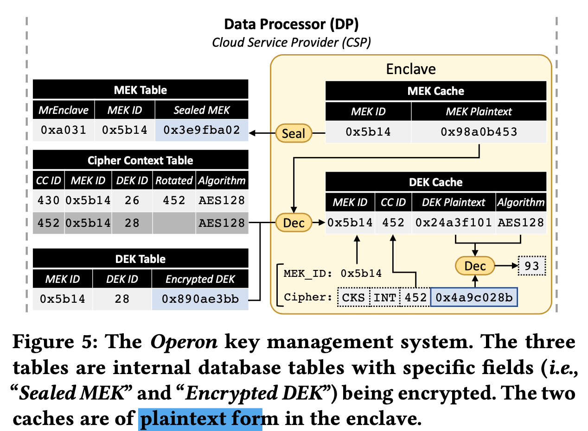
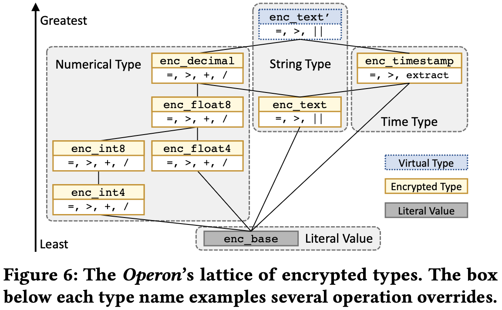

Questions

1. why not all ops on ciphertext? This solution cannot handle ownership. 

2. Why the subject's DEK?

3. Why DEK has a range?

   there is a unique DEK for each table column

4. Why Enclave, 

   protect the primitive operations? 

5. Why execute query on cipher? 

# Introduction

## Background & Motivation

The current database mostly focuses on efficiency, availability, and scalability. 

Conventional security databases run in a private cloud, and the user has full access to the data.

But the private cloud may not be safe due to 

- The data in the private cloud can be compromised by insiders. 
- The data could flow between different sub-systems, which will be out of the data owner's control.

## Gap

Existing work has two solutions.

- Use cryptography to encrypt the data and support data manipulation directly over ciphertext. 
- Use TEE to operate on sensitive data in isolated enclaves inaccessible. 

But existing system **assumes the authorized endpoint** directly interacting with the database is **trusted** and can touch sensitive data, which is hard to achieve. 

## Challenge

Simply extending prior systems with data confidential protection is insufficient. 

Two challenges:

- Flexible architecture makes the system adapt to different data, TEE, and subsystems.
- Offer rich functionality while preserving data ownership.

## Goal

Propose an ownership-preserving database (OPDB), with which the data is not even revealed to any subsystems, and the owner exclusively governs data accessibility. 

Contributions:

- Use BCL (behavior control list) to achieve OPDB, and use TEE to provide the solution. 
- Security and privacy analysis.
- Evaluation.

# Overview

## TEE

It provides execution isolation, remote attestation, and data sealing.

- The untrusted part interacts with the trusted part with **ECall**.
- TEE provides remote attestation that allows the client to verify the authenticity of the enclave and its loaded code/data on a remote host. This establishes a secure channel between the client and the enclave, and the data owner can safely pass the secret keys. 
- **Hardware-dependent data sealing** enables it to persist the data on the host securely by deriving a sealing key from hardware identity and loaded binary. Thus, only the original enclave on the original machine can read it.

## Threat Model

The service provider can monitor the content of resources and tamper execution logic. 

The service provider cannot access enclaves, but the communication between the enclave and host is exposed to the service provider. 

Exclude the TEE side-channel attacks.

## System Overview

DO issues BCL and secret keys to the enclave via a secure channel. => let Operon process ciphertext. Thus, only enclave and DO can have plain text. 

Roles

- Data owner: 
  - Owns the data and uses the data. 
  - DO grants the DM **operators and measures** based on logic. 
- Data manipulator: Build applications that use the data. 
- Data processor: 
  - Run the application and process the data.
  - Enforces authorization while executing the operators and measures.

The separation between DO, DM, and DP:

- **Without the DO/DM separation, a DO cannot utilize third-party data processing applications while preserving data ownership,** 
- With DM and DP separation, DO can only trust a compact system. 

# Data ownership management

## Paradigm definition

- An entity can not access sensitive data content without the data owner’s authorization. 
  => others cannot access it. (achieved by encrypting it and then sending it out. )

- An entity can only conduct authorized operations on sensitive data without knowing its content. 
  => others cannot perform operations revealing data property. 

  => this is defined as an operator.

- An entity can only use authorized operations to **learn the properties** of sensitive data. 

  => facilitate the application execution. 

  => this is defined as a measure.

## Data behavior control and processing

The access control list can only be granted access at the participant level, not at the operation/behavior level. Once the subject (DM or DP) gets access to data, it's out of the user's control. So the paper uses BCL to control the behavior of data and uses TEE to validate the authenticity of BCL. 

- BCL is a list of operational tasks and DEKs, (Data Encryption key => for dec it and then operating it. )
- BCL requires signs from both DO and subjects.
- DO can configure the privacy level of Operon. 
  The system use measure instead of operations to rich more features. At the same time, it can be disabled at the cost of sacrificing feature richness. 

# System Design and Implementation

DP => flexible and less-intrusive system to provide a stable and consistent user experience.

DM => easy to use, compatible as plaintext database. server-side + client-side. 

- server-side: key management, connection pool, parallel processing, type system.
- client-side: SDK for data encryption and decryption. a driver likes JDBC.

## Server-side

### Key Management

It uses two-layer key hierarchy => reduce the key manamge cost at DO side. 

- lower layer encrypt data using DEK.
- upper layer encrypt DEKs using MEK.

Cipher as a header and value, header includes data type, CCID and CKS (check sum)

- CKS => protect the ciphertext from unintentional corruption or misoperation.

### Stateless computation

Stateless computation inside the computation module facilittates rich features. To make it stateless:

- Failing-fast
  - Error handling in Enclauve is challenging. When the result buffer overflows, the computation module switch to the scheduler to reallocate the buffer, thus incure context switch overhead. This context switch not only complicate the design but also incraese the attacking surface. 
  - The paper uses a buffer outside enclave to test if there will be buffer overflows.
- Caching soft-states
  - Cache soft-states (Keys & BCLs) inside enclave. 

### Type System

Supporting mixed type expressions not only improves ease of use but also supports queries.

The paper proposes a type system for encrypted types. 

- A

### Indexing

ECall and cryptographic primitives has clear overheads, 

The paper replace ECall-based comparison measure with ECall-less order-revealing encryption measure (ORE). It uses CLW ORE algirithm.

## Client-side

Includes a SDK for key management, cache DEK, encrypts data for query and decrypts ciphertext results. 

The paper proposes a OpenJDBC which can analysis query statement, automatic data encryption/decryption by calling the SDK.

- OpenJDBC parse the query to AST, acquires the function sigatures and table schema to label AST, replace plaintext with cipher, cache to improve efficiency.

# Security & Analysis

Dual-signature from both DOs and subjects (DMs)

- To 

# Evaluation

## Microbenchmarks

### TEE Overhead

### Index performance

Measure overall throughput of queries under conditions

- Plaintext.
- Ciphertext.
- Ciphertext + ORE

## Macrobenchmarks

Measure throughput under conditions:

- Only encrypt few column
- Encrypt all column excepts primary key. 

And using two encryption method - RND and DET.

And using two datasets - smallBank and TPC-C.