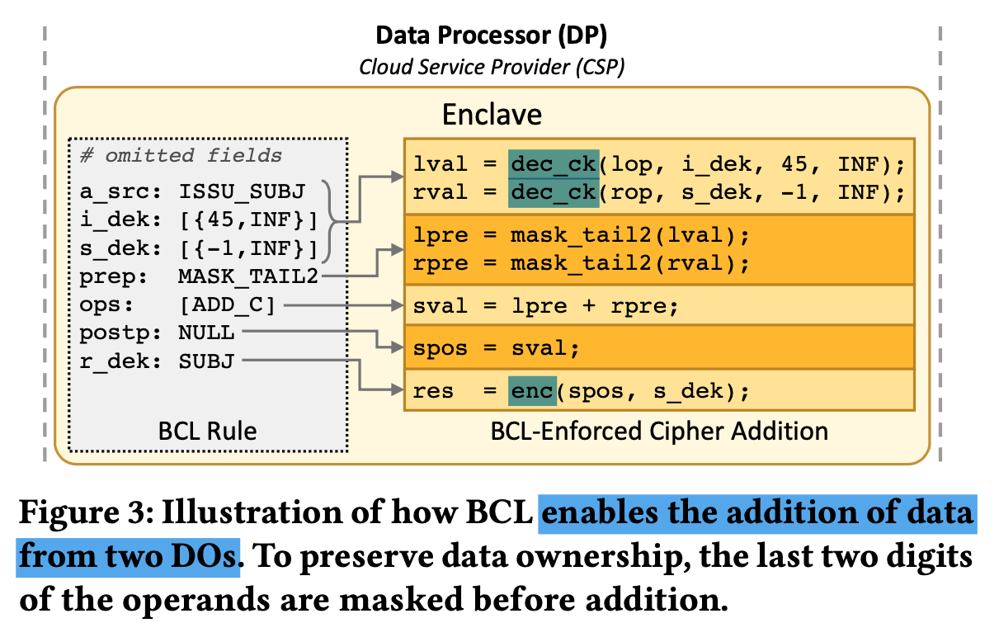
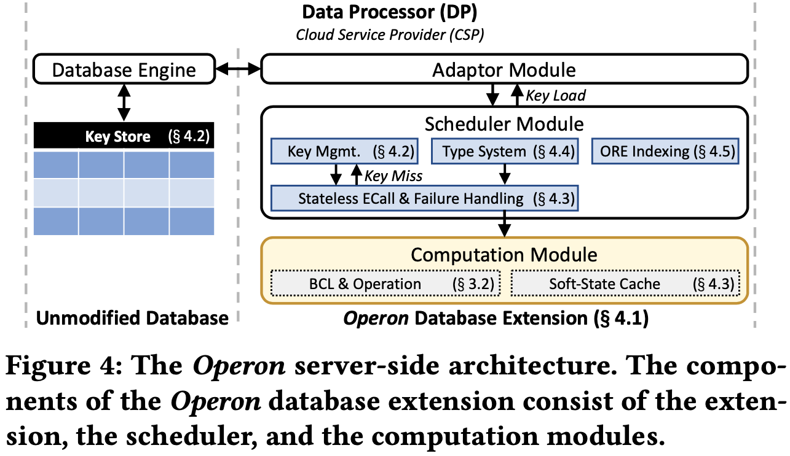

{:toc #markdown-toc}

Questions

1. why not all ops on ciphertext? This solution cannot handle ownership. 

2. Why need the subject's DEK?

3. Why DEK has a range?

   1. To allow key rotation,
   2. there is a unique DEK for each table column

4. Why use Enclave

   1. to protect the primitive operations? 

5. Why execute a query on cipher? 

   1. 

6. how does BCL guarantee ownership? Why other can others not conduct arbitrary ops on cipher?

   

7. How is BCL transferred

   

8. why need MEK? 

   

# Introduction

## Background & Motivation

The current database primarily focuses on efficiency, availability, and scalability. 

Conventional security databases run in a private cloud, and the user has full access to the data.

But the private cloud may not be safe due to 

- Insiders can compromise the data in the private cloud. 
- The data could flow between different sub-systems, which will be out of the data owner's control.

## Gap

Existing work has two solutions.

- Use cryptography to encrypt the data and support data manipulation directly over ciphertext. 
- Use TEE to operate on sensitive data in isolated enclaves inaccessible. 

But existing system **assumes the authorized endpoint** directly interacting with the database is **trusted** and can touch sensitive data, which is hard to achieve. 

e,g. Once the data owner grant software to use the data, the software can conduct operations to get the order information even though it's cipher data. 

## Challenge

Simply extending prior systems with personal data protection is insufficient. 

Two challenges:

- Flexible architecture makes the system adapt to different data, TEE, and subsystems.
- Offer rich functionality while preserving data ownership.

## Goal

Propose an ownership-preserving database (OPDB), with which the data is not even revealed to any subsystems, and the owner exclusively governs data accessibility. 

Contributions:

- Use BCL (behavior control list) to achieve OPDB and TEE to provide the solution. 
- Security and privacy analysis.
- Evaluation.

# Overview

## TEE

It provides **execution isolation, remote attestation, and data sealing**.

- The untrusted part interacts with the trusted domain with **ECall**.
- TEE provides remote attestation that allows the client to verify the authenticity of the enclave and its loaded code/data on a remote host. This establishes a **secure channel** between the client and the enclave, and the data owner can safely pass the secret keys. 
- **Hardware-dependent data sealing** enables it to persist the data on the host securely by deriving a sealing key from hardware identity and loaded binary. Thus, only the original enclave on the original machine can read it.

## Threat Model

DM and DP are not trustworthy.

The DP can monitor the content of resources and tamper execution logic but cannot access enclaves.

The communication between the enclave and the host is exposed to the service provider. 

Exclude the TEE side-channel attacks.

## System Overview

DO issues BCL and shares secret keys to the enclave via a secure channel. => let Operon process ciphertext. Thus, only enclave and DO can have plain text. 

Roles

- Data owner: 
  - Owns the data and uses the data. 
  - DO grants the DM **operators and measures** based on logic. 
- Data manipulator: Build applications that use the data. 
- Data processor: 
  - Run the application and process the data.
  - Enforces authorization while executing the operators and measures.

The separation between DO, DM, and DP:

- **Without the DO/DM separation, a DO cannot utilize third-party data processing applications while preserving data ownership,** 
- With DM and DP separation, DO can enjoy rich services and only trust a compact system (inside enclave). 

# Data ownership management

## Paradigm definition

- p1: An entity can not access sensitive data content without the data owner’s authorization. 
  - Others cannot access it. 
  - Achieved by encrypting it with SK.
- p2: An entity can only conduct authorized operations on sensitive data without knowing its content. 
  - Others cannot perform functions revealing data property. e,g. orders of data records.
  - Achieved by decoupling data-owner and data operation action.
  - This is defined as an operator.
- P3: An entity can only use authorized operations to **learn the properties** of sensitive data. 
  - Facilitate the application execution. 
  - Achieved by fine-grained control of data operation. (BCL)
  - this is defined as a measure.

## Data behavior control and processing

The access control list can only be granted access at the participant level, not at the operation/behavior level. Once the subject (DM or DP) gets access to data, it's out of the user's control. 

So the paper uses BCL to control data behavior and TEE to validate BCL's authenticity. 

- BCL is a list of operational tasks and DEKs (Data Encryption key => for dec it and then operating it. )
- BCL requires signs from both DO and subjects.
- DO can configure the privacy level of Operon => trade the off-trade-off between security and compatibility.
  The system use measure (return plaintext) instead of operations to rich more features. At the same time, it can be disabled at the cost of sacrificing feature richness. 
  - Return cipher: more complex logic and large TCB size in TEE
  - return plain: feature richness & compatibility with existing DB.

# System Design and Implementation

DP => flexible and less-intrusive system to provide a stable and consistent user experience.

DM => facilitate application development. 

**System goal**: make new functionalities **easy to use** and **compatible** with how plaintext databases are used. 

Solution: server-side + client-side. 

- Server-side: key management, connection pool, parallel processing, type system, and indexing. 
- Client-side: SDK for data encryption and decryption. A driver likes JDBC.

## Server-side

Decides the boundary between untrusted and trusted parts. 

- Putting the whole DB into a database has limitations (large TCB size, not implementing the OPDB paradigm)
- Design system as an extension of the database engine for riching system's flexibility. e,g. easy to change database and enclave.
  - Adaptor: connect DB to schedule.

### Key Management

It uses a two-layer key hierarchy => and reduces the KEY management cost on the DO side. 

- The lower layer encrypts data using DEK.
- The upper layer encrypts DEKs using MEK.

Cipher as a header and value, title includes data type, CCID, and CKS (checksum)

- CKS => protect the ciphertext from unintentional corruption or misoperation.

### Stateless computation

Stateless computation inside the computation module facilitates rich features. To make it stateless:

- Failing-fast
  - Error handling in Enclave is challenging. When the result buffer overflows, the computation module switches to the scheduler to reallocate the pad, thus ensuring context switch overhead. This context switch complicates the design and increases the attacking surface. 
  - The paper uses a buffer outside the enclave to test if buffer overflows will occur.
- Caching soft-states
  - Cache soft-states (Keys & BCLs) inside enclave. 

### Type System

Supporting mixed-type expressions improves not only ease of use but also supports queries.

The paper proposes a type system for encrypted types. 

- A

### Indexing

ECCall and cryptographic primitives have clear overheads, 

The paper replaces the ECall-based comparison measure with ECall-less order-revealing encryption measure (ORE). It uses the CLW ORE algorithm.

## Client-side

Includes an SDK for crucial management, cache DEK, encrypts data for a query and decrypts ciphertext results. 

The paper proposes an OpenJDBC which can analyze query statements and automatic data encryption/decryption by calling the SDK.

- OpenJDBC parses the query to AST, acquires the function signatures and table schema to label AST, and replaces plaintext with cipher and cache to improve efficiency.

# Security & Analysis

Dual signature from both DOs and subjects (DMs)

- To 

# Evaluation

## Microbenchmarks

### TEE Overhead

### Index performance

Measure the overall throughput of queries under conditions

- Plaintext.
- Ciphertext.
- Ciphertext + ORE

## Macrobenchmarks

Measure throughput under conditions:

- Only encrypt a few columns
- Encrypt all columns except the primary key. 

And using two encryption methods - RND and DET.

And using two datasets - small bank and TPC-C.