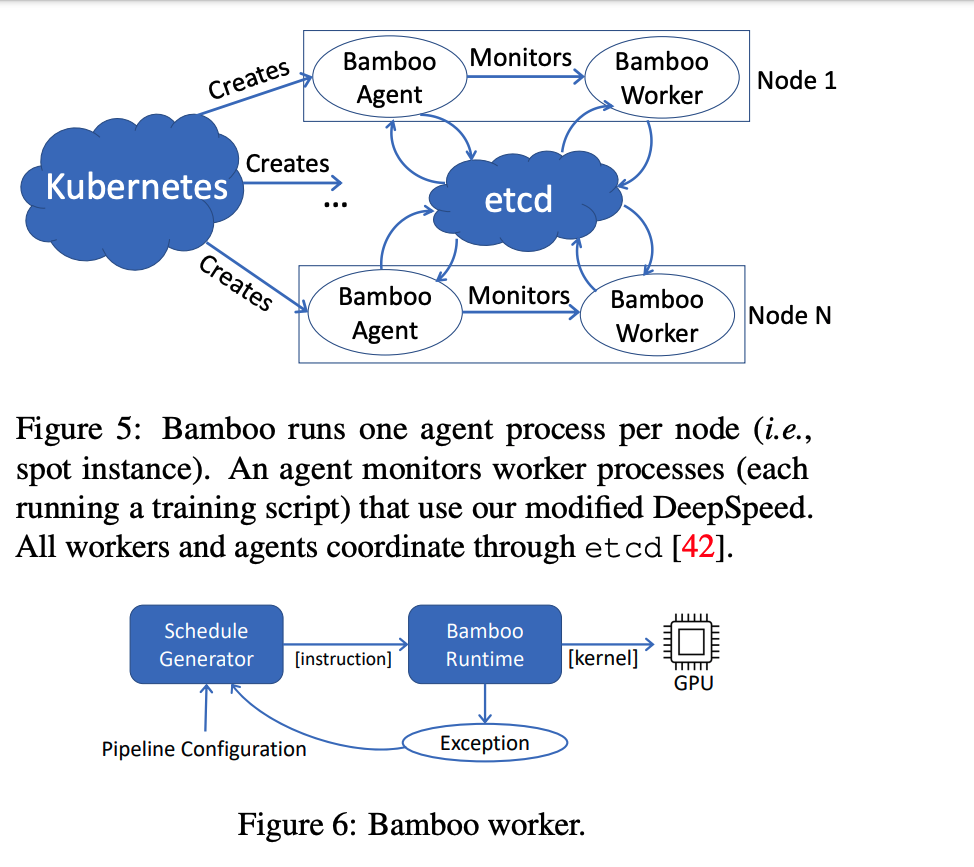
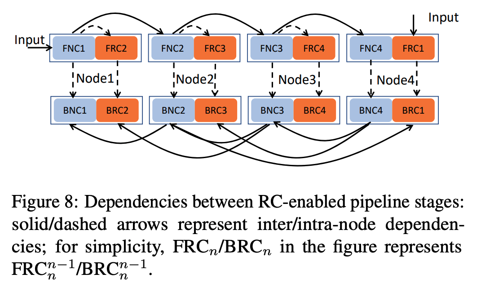

- index
{:toc #markdown-toc}
# Introduction

## Background & Motivation

DNN models grow in size and lead to high resource costs. It is important to train the large model at a low cost. 

## Gap

Most existing work only focus on scalability and efficiency, with high cost. Not much work considers **cost-efficiency** (measured by performance per dollar.)

## Goal

This paper proposes a **resilient and efficient** ML system to train the large model and **effectively using preemptible instances.**

- Resilient: can tolerate node failure.
- Efficient: high training throughput, high recover speed.

## Challenge

Using spot-instance incurs major challenges in **reliability and efficiency** due to the **frequent and unpredictable nature of preemptions.**

- Model training is stateful and time-consuming.
  - Discard the states and re-compute them incurs high computation costs. 
  - Checkpointing-based techniques spend a significant fraction of training time (77%).

# Details

The paper first illustrates that the traditional approach to solving the preemption instances is not working well.

- checkpointing: spend more time
- sample dropping: cannot converge. 
- live migration in grace period ( migrate data from the preempted node to a live node): notice time is too short, save the necessary states and move it to the healthy node. Besides, this approach requires maintaining some idle servers, leading to over-provision problems. 

The paper mainly uses 

- redundant computation (RC) with pipeline model training. And RC is scheduled to the idle time of GPU. 
- Reconfigurations when the consecutive preemptions do happen. 

## Redundant Computation

Quickly recover from preemptions:

- Assume each node only have one model partition; each partition's replica is stored at the previous node. 

Schedule to reduce the Redundant Computation's memory and computation overhead.

- Schedule RC to the bubble to reduce the forward computation overhead. 
  - The paper experimental verify the bubble size is enough to schedule to run the RC.
  - Overlap the normal computation of one micro-batch and RC of another micro-batch
- Perform backward RC lazily to reduce the backward computation and communication overhead.
  - The backward RC requires the output of other nodes, thus incurring high communication costs. So calculate it lazily.
- Offload unnecessary/less-frequently used tensors to CPU memory to reduce memory overhead.
  - Since backward RC lazily, its dependence data, such as the forward-RC;s output and intermediate results, are stored in the CPU.

## Pipeline Reconfiguration

After node failure, the model is un-balanced partitioned. 

The goal of reconfiguration is to rebalance pipelines so they can withstand more failures as training progress and continue to yield good performance. And it also keeps more instances to maintain the cluster size. 

The system uses **async checkpointing** to record the model states. And they will be used unless the system restarts after a fatal failure, such as:

- consecutive preemptions
- urgent need to rebalance

Solutions:

- New nodes were added and read from ETCD.

# Evaluation

Macrobenchmarks.

1. Total cost in training five models using on-demands and spot instances.
2. Training throughput
3. Performance-per-dollar (Value)
4. Measure throughput, cost, and value over simulate different failure models. 
5. Compare throughput with checkpointing based system. 

Microbenchmarks.

1. Compare time overhead of RC

