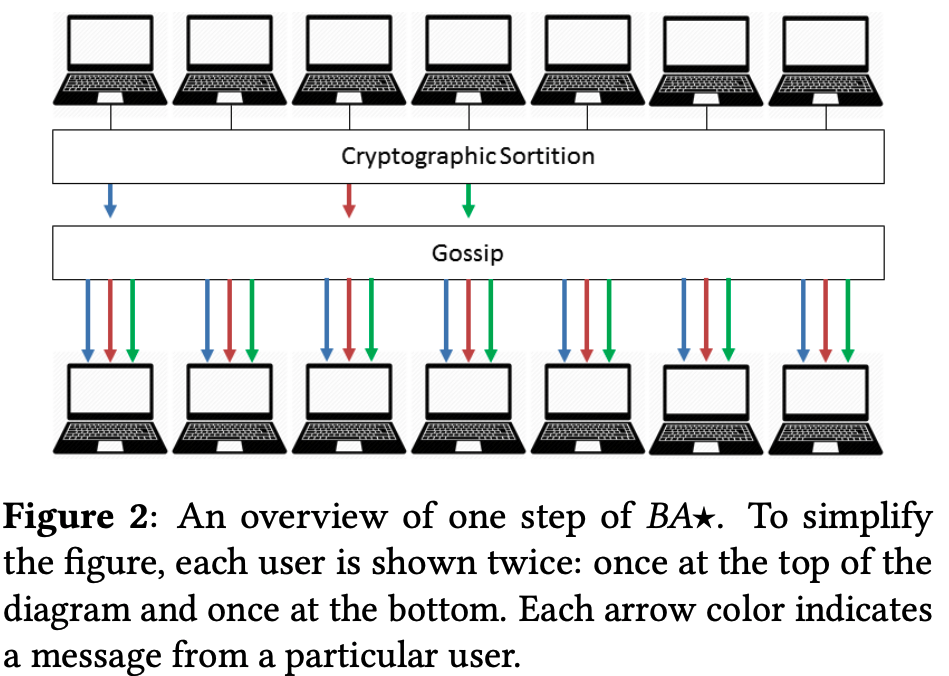
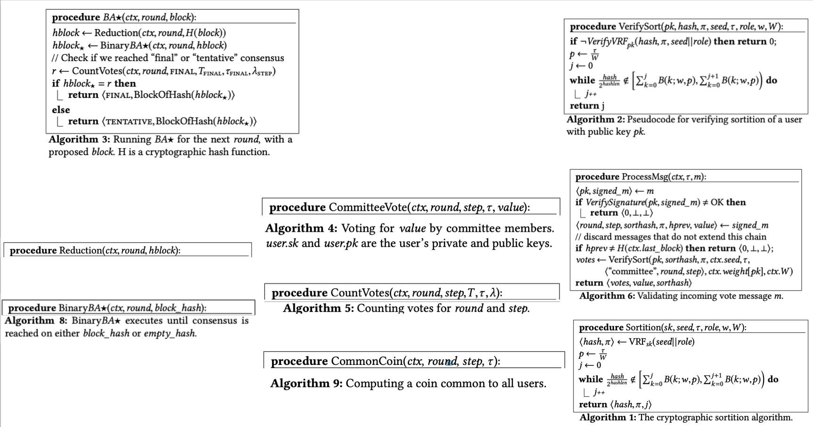
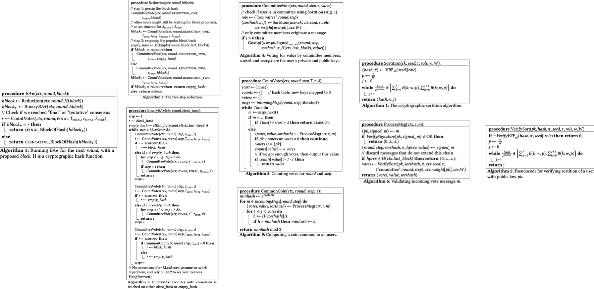

- index
{:toc #markdown-toc}

# Questions

1. Why the user has sub-users j?
2. When the block is choosen? 
3. vote for user of vote for value? why user receive vote? 
4. Why P = tal/W
5. Every user run selected protocol?
6. why there is subusers,? users and subusers? 
6. If only commitee can vote, how to make sure commitee has honest? How many disnonest member used. 
6. Reduction already reach consensus on some value, why still need Binary BA?
6. some user's txs are quickly committed, while other's txs are not quickly committed. 
6. Only commitee cout votes or all users cout votes. 
6. Is it possible for some user who's local txs may always preemeted by others?

# How to handle various threats

- Sybil attacks => addressed by using weighted users. 

- Ctyptographic sortition => select commitee in a private and non-interactive manner => attacter doesn't know who to attack until the user starts participanting in BAstar. 

- Each commitee member only speak once (in other words, replace new commitee in each step ) => the user become relevant to BAstar, attacker targets on commitee member once the member sends a message in BAstar.

In short, the attacker doesn't know who to attack, and once he knows, the commitee may not be the commitee anymore. 

- Replacing commitee member => Reduce Dos attacks. 

- Avoiding fork => 
  - Two kinds of consensus, namely, final and tentative consensus. 
  - Periodically onvokes BAstar to reach consensus on which fork should be used going forward. 

# Liveness and Safety

## Liveness

- Assume strong synchrony.

## Safety

- Assume weak synchrony. 

# Introduction

## Background & Motivation

Cryptographic currencies enable new applications such as smart contracts and fair protocols. It also avoids trusted centralized authorities.

## Gap

However, current proposals suffer from a **trade-off between latency and confidence.** 

- Achieving high confidence requires an hour-long wait ( An hour to confirm a transaction in Bitcoin, wait for six bocks; Otherwise, there are double-spending problems. )
- It achieves 1 MByte block of transactions in 22 seconds with 50,000 users.

## Goal

This paper presents Algorand, a new cryptocurrency designed to confirm **transactions on the order of one minute.** It mainly relies on the BA protocol, BASTAR, to reach a consensus on a new block with low latency and without the possibility of forks. 

**Highlights**

- Proof of Stake based Cryptocurrency 
- High throughput: ~1 min to confirm transactions vs an hour in Bitcoin
- Public ledger with **low probability of forks**
- Assumes 2/3-honest stake majority

## Challenge

- Avoid Sybil attacks
- Be able to scale to millions of users.
- Be resilient to denial-of-service attacks. 

## Solutions Overview

- **Weighted users:** 
  - Assign a weight to each user; As long as the majority weighted fraction of the users is honest, consensus can be reached. (avoid fork and double-spending)
  - **To prevent Sybil attacks.**
- **Consensus by committee** 
  - Select a subset of users as committee
  - **Ensure good scalability.** 
- **Cryptographic sortition:** 
  - Each system user independently determines if they are chosen to be on the committee by computing a function VRF. 
  - **Non-interactive  => to prevent an adversary from targeting committee members.** 
- **Participant replacement**
  - Each user only speaks once.

# Protocol summary

**POW**

- Wait for six blocks to confirm one tx due to the possibility of forks.

**Byzantine consensus**

- Requires a fixed set of servers to be determined ahead of time; allowing anyone to join could open up to Sybil's attacks. 
- It cannot scale to a large set of users.
- Some optimization protocols: BFT2F, Honey Badger, Bitcoin-NG, Hybrid consensus, ByzCoin, and Stellar.

**POS**

- Avoid the computation overhead of POW.
- Hard to realize. Since no work is involved in generating blocks, a malicious leader can attack. 
- Some optimization protocols: Ouroboros, 

**Trees and DAGs**

- Replace the underlying chain structured ledger with a tree or DAG.

- GHOST, SPECTRE, Meshcash 

# Technique details

## Goal and Assumptions

**Assumptions:**

- Public-key signatures and hash functions. 
- Honest users run bug-free software.
- The fraction of money held by honest users is above some threshold **(a constant greater than 2/3)**
- An adversary can corrupt targeted users, but an adversary cannot corrupt many users that hold a significant fraction of the money.

**Goals:**

- Liveness: Make progress under various network reachability.
  - Achieved by assuming strong synchrony; 95% of honest users can communicate with time-bound; no network partition. 
- Safety: If an honest user accepts one tx A, then all tx accepted by others will be in the log containing A
  - Achieved by assuming weak synchrony; the network can be asynchronous in a long bound time; 

## Overview

Each user submits a tx to **gossip protocol** and then collects a **block of pending Txs** they hear about.

- Gossip protocol: Each user selects a small random set of peers to gossip messages to. And the message is signed using PK to prevent it from being forged.

Then it uses BASTAR to reach a consensus on **one of those blocks.** 

BASTAR can produce two kinds of consensus:

- Final consensus: Once a block reaches the final consensus, all Txs are confirmed. 
- Tentative consensus:
  - When the network is strongly synchronous, one successor block will eventually reach a final consensus.
  - When the network is weakly synchronous, the fork may happen. Algorand periodically invokes BASTAR to reach a consensus on which fork should be used.

## CRYPTOGRAPHIC SORTITION

This is to choose a random **subset of users** according to per-user **weights** in each round. And the randomness comes from seeds.

**Sortition**

The Algorand mainly uses VRF to choose users randomly. 
$$
hash,  proof = VRF_{sk}(x)
$$

- **Hash** is to be used to decide how many sub-users under this user are selected. 

- **Proof** is to verify if the user is selected, this is acheieved by verifing that hash corresponds to x by using the public key. And verify the number of selected sub-users is publickly verfiable.

**Choose Seed**

Sortition requiresa seed that is chosen at random and publicly known in each round, and the seed is determined using VRF with the seed of the previous round r-1.

**Choose SK**

Choose SK before generating the seed, such that even selected user is malicious, the resulitng seed is random. 

## BLOCK PROPOSAL

This is to choose subset of users as proposers, such that there exists some block in each round. The paper choose 26 proposers in priactise. 

**Reduce communication cost**

The block with highest priority will reach consensus among users. To reduce the communiation costs caused by sending local block to others for each user, the sortition hash is used to prioritize block proposals.
$$
priority = Max(Hash(hash_{sortition} + Index_{subuser0})...Hash(hash_{sortition} + Index_{subuserJ}))
$$
Algorand gossips two kinds of messages

- Msg1: It only contains priority and it's proofs, and send to all users. Each user uses it to discard block with low priority.
- Msg2: It contains the entire block

**Waiting for block proposals**

Waiting for too short will result in empty block, waiting for too long will increase confirmation latency. 
$$
WaitingTime = \lambda_{stepvar} + \lambda_{priority}
$$

## BASTAR

### Two phases

- Phsae1 - Reduction (2 steps):
  - Reduce the problem of reaching consensus on a block into agreement on one of two options.
  - This is to make sure at most one non-empty block hash is passd to BinaryBAstart by all honest users. 
- Phsae2 - BinaryBAstart (2-11 steps): 
  - Reaches agreement on one of these options: either agreeing on a proposed block, or agreeing on an empty block.
  - Two steps if the highest-priority block proposer was honest (sent the same block to all users), and expected 11 steps when facing malicious proposer. 
  - When it's honest proposer, firstly each committor vote for some value, and then all user count votes. 

# Evaluation

Measure latency 

- Vary the user from 5K to 50K.
- Vary the bandwidth ( scale-out.)

Mesure throughput

- Vary block size .

Resource costs

- Measure CPU, network and stoarge usage. 

Misbehaving users

- Latency over increasing of malicious users. 

