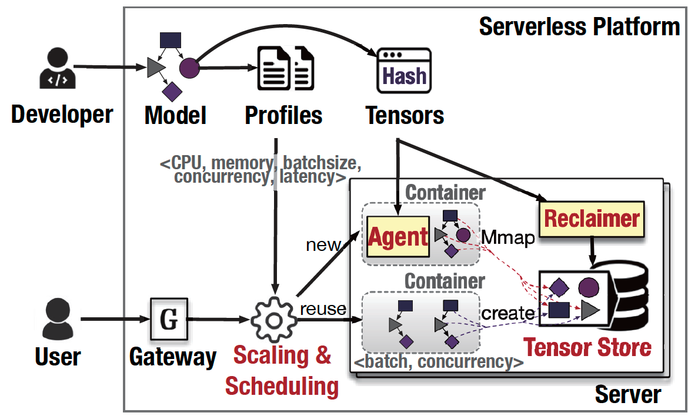
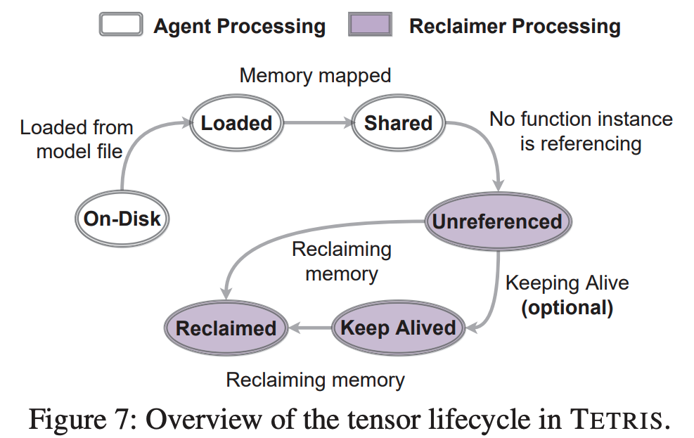

- index
{:toc #markdown-toc}
# Questions

1. The paper shows using a page-cache can reduce the startup latency for functions. But it didn't explain what is cached and why.

# Introduction

## Background & Motivation

Serverless: ease of use; cost efficiency; resource management-free, autoscaling. And serverless inference is widely used.

## Gap

Inference services are memory-intensive. But the current serverless platform (AWS Lambda) does not support inference computation well. 

- They cannot accommodate large inference models (Lambda limits the memory of function < 10GB)
- Mapping each request to a function requires repeating the model, tensor, and library to multiple functions, thus causing a significant waste of memory resources.
- Most functions are short-lived. But the keep-alive caching still occupies the memory, causing a waste of memory resources.

Existing work tries to reduce the memory footprint by concurrent serving and batching. At the same time, this paper shows that **tensor redundancy** also degrades memory efficiency.

- **tensor redundancy** is defined as tensors in the computational graphs of inference models being highly duplicated across function instances. 
- And it is commonly caused by either **replicated function instances** or **identical parts generated by pervasive pre-trained models or transfer learning.**

The **tensor redundancy** problem can be mitigated throughput OS methods, but the traditional page-merging method has high scan overhead, cannot accurately function startup, and has heavy implementation.

## Goal

The paper aims to improve the memory efficiency of serverless inference from reducing **tensor redundancy** perspective. Specifically, it solve it by using **runtime-level sharing** and **tensor-level sharing** techniques.

## Challenge

Tensor sharing have some challenges:

- Non-harming inference latency.
- Safe sharing without data leakage risks
- First-time sharing: start sharing as longs as inference are activated, accelerate the function startup and reduce the OOM errors.
- Easy integration to serverless frameworks.

## Solutions Overview

- Tensor mapping based on MMAP between function instances to reduce the memory usage of a single server. 

# Technique details

## Serverless inference and Tensor redundancy

The serverless inference has high memory overhead, and it's essential to solve it. While Tensor Redundance significantly downgrade the memory efficiency

- Model loading dominates the inference function instance **startup**.
- The model consumes the most memory among all components including program code, libraries, the model, the function call stack, intermediate tensors (i.e., generated at runtime), and the network buffers.
- Concurrent execution and batching can reduce the memory cost but increase the latency. Selecting the best combinations among concurrent execution and batch size is essential for saving memory.
- Tensors are replicated across function instances due to two reasons
  - Multi-version functions: the same model deployed multiple copies for different business pipelines. 
  - Pretraining & transfer learning: Retrain the whole model either incur high overhead or cause overfitting. Picking a few layers to train is a better choice, and the number of layers to re-train is determined empirically. In this way, the un-picked layers are the same for all follow-up job, and replicating it multiple times will cause the memory waste.
- Widespread caching used in the serverless platform and DL library exacerbate the tensor redundancy.
  - Function caching for a period of time to reduce the cold-start overhead.
  - Tensorflow cache MKL-DNN data.

## System Overview

### Scaling and Scheduling

Given the Represent-Per-Second and Model profiles, the scaling is to find the best scale decision to minimize memory usage while guaranteeing the SLO. Specifically, each model is profiled in terms of latency under different running configurations such as CPU, memory allocation, batch size, and concurrent threads. The paper first formalizes ILP and then solves it using the DTS algorithm. And the output of DST is the configuration requirement (CPU, memory) of the new function instance. 

The scheduler then deploys it to the server whose tensor store has maximum tensor similarity compared with the current model.

### Tensor Sharing

After an instance is scheduled into a server, a container is launched, and the agent is activated to load the memory into the memory.

**If a tensor is already loaded into the tensor store, the agent maps its memory address to the instance through MMAP.** Otherwise, it loads a new item in the tensor store. 

### Tensor Store

Store tensor in $hash_{tensor}: tensor$ pair. Each tensor has a reference number indicating how many functions is using the tensor. 

Each server holds one tensor store, and the tensor store can only be accessed with permission,

### Memory Reclaiming

It periodically clears the tensor whose reference number = 0; 

It also supports caching policies and keeps the tensor even its reference number = 0. It supports two cache policies

- keep-alive window: Time-out thread
- LRU

# Implementation

Plz refers to original paper

Shared memory can be enabled by Docker by setting the `–ipc=host` option at the container creation time, allowing all containers to share the host `ipc` namespace, but this introduces significant risks of malicious activities or misoperations.

Hence, the paper instead implements the shared memory by mounting a **memory-based `tmpfs`,** in which the tensor store is just a directory. Then, it could be mounted to each container during its creation time using a command like `docker -v`. Tensors are stored as files under the mounted tmpfs directory, and their hash values are set as filenames. This way, we can build multiple dedicated tensor stores flexibly by creating different mounted directories.

# Evaluation

Micro-benchmark: Tensor sharing evaluation

- Measure the **memory-saving** and **startup** time-saving.
  - Memory: compare memory-saving under different function instances.
  - Startup time-saving: Compare with two baselines, with or w/o package cache. The speedup is due to the reduction of I/O time introduced by the model loading process. 
- Measure under two situations.
  - A different model for different applications, but share some layers of cross-functions.
  - Same model for same application, but multiple function instances

Macro-benchmark: Overall evaluation

- Compare the overall performance (memory usage) with INFless, Photons. Teris-RO (runtime sharing-only, without tensor sharing. )

  Teris-RO is to prove that the scheduling and scaling algorithm can greedly find the best instancing launching method to make sure the memory usage is minim while guaranteeing SLO.

Overhead.

- The paper also discusses some overhead caused by scheduling, profiling, etc. 