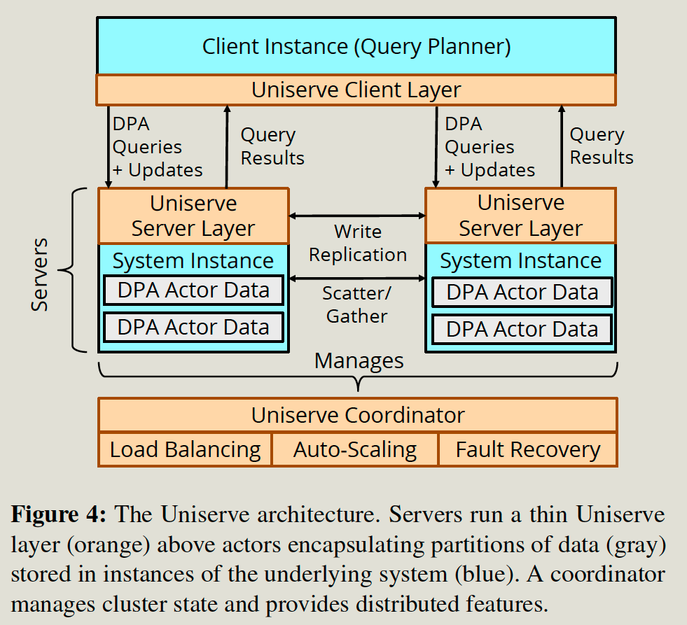
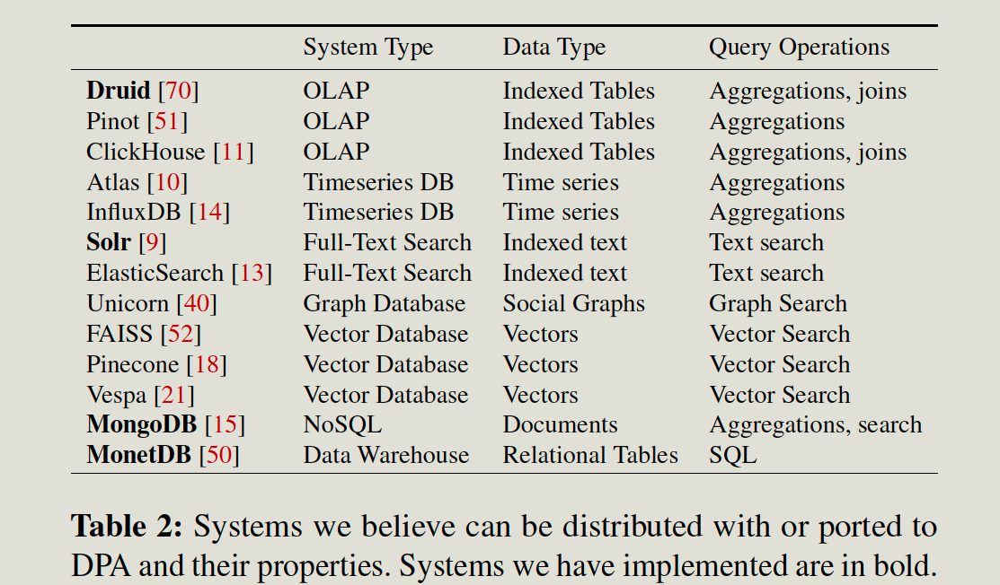

- index
{:toc #markdown-toc}
# Question

1. why is increaing server => high latency?  replication? backup? 

# Introduction

## Background & Motivation

Data-parallel, low-latency system query systems:

- SearchEngine: ElasticSearch, solar.
- OLAP: Druid, Clickhouse.
- TimeSeries: InfluxDB and OpenTSDB.

## Challenge

Implementing those features on each system (MongoDB, Druid, and Solar) is challenging: 

- Hard to build to each of them 

  For example, it takes thousands of lines of code to implement the distributed layer on top of them.

- Need to maintain and add new features.

  For example, it has less support for auto-scaling, and it's challenging to add new features. 

## Gap

Current distributed programming models do not support the unique workloads of query-serving systems.

- Lack of abstractions, consistency, and atomicity for data-parallel operations. 
- Lack of abstractions for managing data.

## Goal

This paper proposes a new programming model (data-parallel actors) DPA to allow users to construct a distributed query serving system from purely single-node components.

DPA runtime (Uniserve) automatically provides the system with complex distributed features such as **fault tolerance, consistency, load balancing, and elasticity**. Besides, it has a configurable consistency level and auto-scaling behavior.

# Technique details

The whole system includes the interface and runtime.

## Programming Interface

Storage

- The system uses an actor to store the data, and data with the same key are mapped to the same actor.
- The actor also exposes methods for manipulating the data.

Query

- UpdateFunction Interface: It provides configurable consistency and atomicity guarantees for updates.
- Parallel Operations: map, retrieve/combine, scatter/gather.

Example:

- Solr: wrapper the data in the actor and use retrieve/combine to conduct searches. Each data is partitioned into shards based on the hash value (sharding key). And the actor includes the inverted index.

## Runtime

The developer implements actors and queries, while runtime help to make it distributed, with fault tolerance, durability, consistency, load balancing, and elasticity.

Uniserve Server Layer

- Data replication, logs of the most recent updates, periodic backing up to storage, and data transfer.

Client layer

- Developer -provided planner, transferred query into DPA parallel operations.
- Learns the actor position from the coordinator and sends it to the corresponding server.

Data replication: 

- Eventual consistency with asynchronous update 
- Update Serializability: implement 2pc
- Full Serializability for both read and update: implement snapshot

Fault tolerance and recovery

- It assumes the coordinator and ZooKeeper are always available.
- All server failures: All replica backups data to durable storage. If all servers are down, the new server will load all from it.
- Primary failure: Backup with the latest updates will be the new primary. 
- Client writes ahead any commit or aborts decision to ZK; server references it if the client fails.

Data placement and load balancing

- Move the most-loaded actors from the most-loaded servers to the least-loaded servers.
- Prefetch data from durable storage, apply update log from primary, replica accepts it, delete from the original image, notify clients.
- Configurable Data placement policy. 

Elasticity and Auto-Scaling

- Provide autoscaling algorithm similar to the cloud; it adds servers if CPU utilization exceeds an upper threshold and removes them if it is below a lower threshold. 
- Configurable auto-scaling policy. 

- 

# Evaluation

Workloads

- Druid => TPC-H

- MongoDB => YCSB

## Benchmarks

- Throughput vs. latency
  - Increase the server until the throughput is not increasing. 
  - Measure the latency. 
- Scalability: 
  - Single client + increased server.
- Data warehouse: 
  - Measure the latency of running a few queries.
  - compared with SparkSQL, Redshift
- Update performance: 
  - Measure update time vs. increased number of updated data. 
  - Compared with the native system
- HotSpots
- Dynamic load
  - Uses dynamic workloads and measures the latency
  - Autoscale can keep increasing the server to meet the target throughput. 
- Failures
  - Manually kill the server and measure how many queries succeed. 
