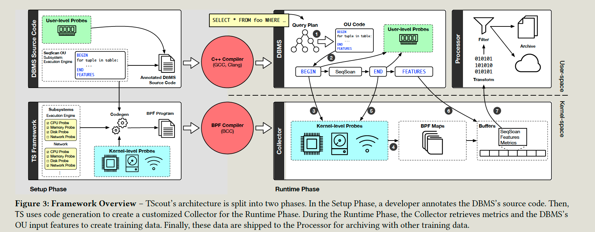

- index
{:toc #markdown-toc}
# Questions

1. Offline training data collection is expensive, but is it obvious compared with model training?
2. If the model training costs more, then the benefits of online data collection are not so obvious. 

# Introduction

## Background & Motivation

Self-driving DBMS seeks to automate the tuning and optimization tasks for the database to fit an objective target function.**(throughput & latency. )**. It includes

- Forecasting model: Predicts the future workloads based on existing workloads
- Behavior model: With the forecasted workloads, it predicts actions relative to the target object.
- planning system: Select the actions which improve the target object

And the actions mainly control 

- physical design
- knob configurations
- Hardware resources.

e,g. add a index => behavior model => CPU/Memory usgae => affect the queries.

While the behavior model needs to be trained with DBMS data, including 

- Several tuples a query will consume. 
- hardware metrics (CPU instructions, memory allocations)

Input features collections:

- It's about collecting the features for the ML model for predicting the corresponding operations.
  e.g., the features for an index lookup model contain schema, data structure type, and a number of index entries. 
- Methods: 
  - External: explain each query, physical plan, and cost estimates.
  - Internal: embed feature collection logic inside the DBMS.

Output features collections:

- It's about collecting the results after applying some actions. Eg. CPU performance counters, network statistics, and other system metrics.

- Efficiently collect the runtime operations without altering their observed behavior.

- Methods: 

  - Explain Analyze: Running it will incur overhead to query execution.

  - User space: It invokes the necessary functions in its source code to enable and disable recording metrics. It then manually **retrieves the metrics** with a final set of function calls.

  - Kernel-space:  It relies on an ancillary program running inside the OS kernel to retrieve metrics. 

    - But traditional OS kernel modules are notoriously difficult to write and could potentially pose several safety issues.

    - The solution is to use Berkeley Packet Filter Library (BFP) 

      BPF allows developers to write event-driven programs in C-like dialect that run in kernel mode to trace the behavior of other processes.

      BPF: program => bytecode => machine code.

      The BPF approach generates the same data as user-space syscalls, but with fewer execution mode switches, resulting in better performance.

  

Offline data or online data

- Offline data: 
  - deploy a clone of the production instance and replay a workload trace. 
  - It's costly to replay all workloads and re-train the model once the DBMS software changes.
- Online data: 
  - collects the training data as it executes the application’s queries
  - It exactly reflects the DBMS's current workload, database, and environment.

## Gap

An offline data collection method has limitations, such as copying whole DB data and conducting the training.

- It requires significant time and computational resources to train.
- You cannot try all combinations of physical design and knob configurations. 

## Challenge

Online training data collection can quickly fit the model to the new behavior.

- Online data collection is bespoke and imposes runtime overhead.

It takes work to efficiently and accurately conduct online data collection.

## Goal

The paper presents the TS framework for the efficient and accurate collect training data in self-driving DBMSs.

- Collects metrics using hardware-level performance counters, kernel-level observations, and application-level counters.
- Combine those to form training data.

# Technique details

The paper uses

- Internal inputs feature collections
- Kernel-space output metrics from online workloads.

Setup phase

- It is to modify the system source code to indicate when, where, and how TS collects training data.
- Users add marks to the source code, marks, e.g., **begin, end, and features.**
- TS extracts the embedded metadata from DBMS to determine which metrics it needs to collect per subsystem.

Runtime phase

- The controller records the information, stores intermediate to BPF maps, and then packages the features and metrics into the buffer. 
- The processor extracts and archives the training data, and do the additional cleaning, and write to the output target.

Metrics collections;

- TS uses so-called probes to collect the resource metrics. Probs are reusable code runs defined by the makers in DBMS.
- CPU: kernel-level functions to collect instructions, reference CPU cycles, and caching metrics. 
- Memory: user-level probs in the framework.
- Network probs: kernel-level probe for accumulating the results of networking syscalls
- Disk probs: a kernel-level probe that calculates bytes read and written for disk IO

