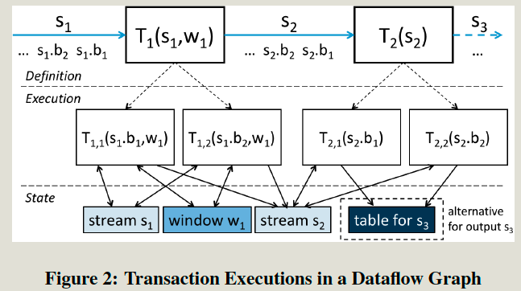

- index
{:toc #markdown-toc}

# Summary
1. The main difference between OLTP tx and Streaming Tx:

   Streaming Tx can use some benefits of streaming, such as **push-based processing and **order processing.**

   While the OLTP accesses data pull-based, it cannot have **push-based processing**, and the **order processing** is implemented on the client side. 

2. Stream is to send data to query, while OLTP is to send questions to data.

# Questions

Why does client-side ordering management have low throughput? Is it due to networking issues? 

- The client received the results. Based on this, the client decides the following execution plan, which takes time, while S-Store triggers all the subsequent operations on the DB side. 

# Introduction

## Background & Motivation

Streaming systems: **Executing SQL-lite operators on an unbounded and continuous input data stream.**

- The second generation of the Streaming system allows users to create their operators, which are invoked and managed by a shared infrastructure.

The objective of the Streaming System is: **Reduce the latency of results.**

While the in-memory OLTP system supports ACID but lacks the **notion of stream-based processing**, such as **unbounded data, push-based data arrival, order processing, and windowing.** 

While many applications require both ACID of OLTP and stream-based processing functionalities in the streaming system. E.g.:

- Groups of updates must be added automatically.
- Conducts a few ETFs to clean and integrate data.
- Push-based processing on the following Tx.

## Gap

The second streaming system still doesn't support ACID transactions, leaving applications open to potential **inconsistencies**.

## Goal

This paper designs and implements S-Store, a single system for processing streams and transactions with well-defined correctness guarantees and low latency compared to client-side ordering control.

# Details

## Data Model:

- Streaming is an **ordered**, **unbounded** collection of tuples. Each of which has a timestamp. 

  Tuples with the same timestamp are a group and should be processed as a unit. ( In one Tx with atomicity )

  The streaming output will have the same batch-ids as the input stream.

- Shared-states: 

  - Public tables.
  - Windows: should be shared only in consecutive executions.
  - Streams.

## Processing Model

- The **computation** on stream is expressed as dataflow (DAG) of user-defined analyses such as relational-style operators or others.
- **Batches** set the **atomic boundaries** for each transaction, while windows are used to bound computations defined inside T. 
- **Push-based** processing model.
- **Correct Execution order** 
  - For streaming transactions:
    - **Batch-level ordering:** For the same batch, 1st Tx < 2nd Tx.
    - **Stream-level ordering**: In one stream, 1st Batch < 2nd Batch.
  - For hybrid workloads (Streaming Tx & OLTP Tx)
    - Could build nested Tx for streaming Tx, such that they can be isolated from OLTP tx when all Tx access the shared public table. 

## Architecture

It builds S-Store on top of the H-store.

- **Streams**: Stream data are stored in a time-varying H-Store table,  and removed after consumption.

- **Triggers are associated with a stream table or a window table; once new tuples are added, downstream processing will be automatically activated. ( **push-based processing** on states.)

  - Partition Engine Trigger:  Trigger the following streams Tx,
    It eliminates the need to return the results to the client.
  - Execution Engine Trigger: Trigger the following executions inside one Tx. 
    It is to eliminate the **communication** between EE and PE layers.

- **Streaming Scheduler**: It ensures **correct transaction ordering**. The simplest solution is to require the TEs in a dataflow graph for a given input batch always to be executed in an order consistent with a specific topological ordering of that dataflow graph.

- **Recovery Mechanism**: It uses periodic checkpointing and command-logging mechanisms. The recovery scheme ensures **exactly-once processing.**

  - Strong recovery: exactly the same state as was present before the failure.

    Each committed tx (OLTP and streaming) are recorded in the command-log file; failure occurs, and the system replays the log starting from the **latest snapshot.** 
    It needs to **disable the trigger** to prevent redundant executions.

  - Weak recovery: a legal state which may not be the same loss.
    You don't need to log all committed tx. Lightweight. 

# Experiments

Measure throughput

Macro:

- Compare with Storm, Esper, and Hstore (async & sync)
- S-Store outperforms Hsotre (Sync); in Hstore (Sync), the client will manage the ordering of the execution and receive the previous response before sending the subsequent request. 

Micro:

- PE triggers, EE trigegers, Recovery model.

